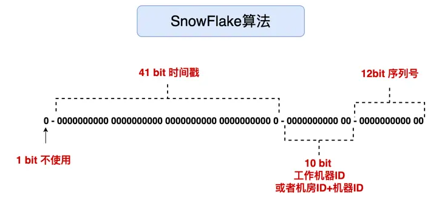

## 每日BUG-1
>曾记否，昨日的bug，你以为我找到了？不，我没有，我改的数据库，我错了。
>
>我在变量响应这边设置的最低长度是4，我个智障一直用我的名字三个字来测试，日志上显示报错
> 
>我也一直没有往长度这方面想，毕竟username的汉字编码会下意识觉得不会被影响，但我错了555,bug就在于此， 然后查了下抖音的最短ID是4个字，我也改成4个字了。
```
 "/douyin/user/register/?username=%E5%A4%A7%E5%82%BB%E9%80%BC&password=123456"
```

## 系统设计的三高

- 高性能，程序占用尽量少的CPU与内存，请求速度足够快
- 高可用，系统在一段时间内不可服务的时间很短，比如全年停机不超过31.5秒，也会是99,.9999%
- 高并发,系统开发过程中，能够保证系统可以同时处理多个并行请求
### MySQL
- Mysql限制每个表的最大列数为4096列 ,但是事实上根本不可能到达4096列.InnoDB限制每个表的最大列数为1017列.
- Mysql对行也有限制，行的总量大小最大为65535


## 系统设计
当业务场景需要给用户发送网络地址或者二维码时，由于地址的长度比较长，通常为了占用更少的资源和提升用户体验。例如，谷歌搜索“计算机”词条地址如下：
>
>https://www.google.com/search?q=%E8%AE%A1%E7%AE%97%E6%9C%BA&ei=KNZ5Y7y4MpiW-AaI4LSACw&ved=0ahUKEwi87MGgnbz7AhUYC94KHQg
>wDbAQ4dUDCBA&uact=5&oq=%E8%AE%A1%E7%AE%97%E6%9C%BA&gs_lcp=Cgxnd3Mtd2l6LXNlcnAQAzIECAAQQzIFCAAQgAQyBQgAEIAEMgUIABCABDIF
>CC4QgAQyBQgAEIAEMgUIABCABDIFCAAQgAQyBQgAEIAEMgUIABCABDoKCAAQRxDWBBCwAzoLCC4QgAQQxwEQ0QM6FggAEOoCELQCEIoDELcDENQDEOUCGA
>E6BwguENQCEENKBAhBGABKBAhGGABQpBZYzSVglydoA3ABeACAAZ0DiAGdD5IBCTAuNy4xLjAuMZgBAKABAbABCsgBCsABAdoBBAgBGAc&sclient=gws-wiz-serp

 如果将这一长串网址发给用户，是十分不“体面”的。而且，遇到一些有字数限制的系统里面，比如微博发帖子就有字数限制，肯定无法发送这样的长链接地址。一般的短信链接中，大多也都是短链接地址.
 为了提升用户体验，以及日常业务的需要。我们需要设计一个短链接生成系统，除了业务功能实现以外，我们还得为全国的网络地址服务。在这么大的用户量下，数据该如何存储，高并发如何处理呢？

## 三种链接生成方法
###  需求分析
链接生成、网址访问、缓存优化和高可用四个方面开始着手设计：

**1、生成短链地址**
可以考虑用 UUID 或者自增 ID。对于每一个长链接转短链地址时，都必须生成一个全局唯一的短链值，
不然就会发生冲突。所以，短链接的特点是：

- 数据存储量很大，全国的网址每天至少都是百万个短链接地址需要生成；

- 并发量也不小，遇到同时来访问系统，按一天 3600 秒来算，平均每秒至少上千个请求数；

- 短链接不可重复，否则会引起数据访问冲突。

**雪花算法**
生成短链接，可以用雪花算法+哈希的方式来实现。
雪花算法是在分布式场景下，根据时间戳、不同的机器 ID 以及序列号生成的唯一数。它的优点在于简单方便，随取随用。
通过雪花算法取到的唯一数，再用哈希映射，将数字转为一个随机的字符串，如果短链字符串比较长，可以直接取前 6 位。
但是，由于哈希映射的结果可能会发生冲突，所以对哈希算法的要求比较高。


**布隆过滤器**

布隆过滤器是一个巧妙设计的数据结构，它的原理是将一个值多次哈希， 映射到不同的 bit 位上并记录下来。
当新的值使用时，通过同样的哈希函数，比对各个 bit 位上是否有值：
如果这些 bit 位上都没有值，说明这个数是唯一的；否则，就可能不是唯一的。
当然，这可能会产生误判，布隆过滤器一定可以发现重复的值，但也可能将不重复的值判断为重复值，
误判率大概为 0.05%，是可以接受的范围，而且布隆过滤器的效率极高。
因此，通过布隆过滤器，我们能判断生成的随机数是否重复：如果重复，就重新生成一个；
如果不重复，就存入布隆过滤器和数据库，从而保证每次取到的随机数都是唯一的。

### 2、长短链接关联
每当生成一个短链接后，需要在 MySQL 存储短链接到长链接的映射关系并加上唯一索引。

重定向过程
浏览器访问短链接服务时，根据短链地址取到原始 URL，然后进行网址重定向。我们通常有两种重定向方式：

- 一种是返回给浏览器 301 响应码永久重定向，让其后续直接访问真实的 URL 地址；
- 一种是 302 临时重定向，让浏览器当前这次访问真实 URL，但后续请求时还是根据短链地址访问。

虽然用 301 浏览器只需一次请求，后续可以直接从浏览器获取长链接，这种方法可以提升访问速度，但是它没法统计短链接的访问次数。
所以根据业务需要，我们一般选用 302 重定向。

### 3、缓存设计
由于短链接是分发到多个用户手里的，可能在短时间内会多次访问，所以从 MySQL 写入/获取到长链接后可以放入 redis 缓存。
1）加入缓存
并且，短链接和长链接的对应关系一般不会频繁修改，所以数据库和缓存的一致性通过简单的**旁路缓存模式**来保证：

读（Read）数据时，若缓存未命中，则先读 DB，从 DB 中取出数据，放入缓存，同时返回响应；
写（Write）数据时，先更新 DB，再删除缓存。

当用户需要生成短链接时，先到这个映射表中看一下有没有对应的短链接地址。有就直接返回，并将这个 key-value 的过期时间增加一小时；没有就重新生成，并且将对应关系存入这个映射表中。
缓存的淘汰策略可以选用：


- LRU：Least Recently Used，最近最少使用算法，最近经常被读写的短链地址作为热点数据可以一直存在于缓存，淘汰那些很久没有访问过的短链 key；


- LFU：Least Frequently Userd，最近最不频繁使用算法，最近访问频率高的短链地址作为热点数据，淘汰那些访问频率较低的短链 key。


2）缓存穿透
但是，使用缓存也防止不了一些异常情况，比如“缓存穿透”。所谓缓存穿透，就是查询一个缓存和数据库中都不存在的短链接，如果并发量很大，就会导致所有在缓存中不存在的请求都打到 MySQL 服务器上，导致服务器处理不了这么多请求而阻塞，甚至崩溃。
所以，为了防止不法分子通过类似“缓存穿透”的方式来攻击服务器，我们可以采用两种方法来应对：

- 对不存在的短链地址加缓存，key 为短链接地址，value 值为空，过期时间可以设置得短一点；
- 采用布隆过滤器将已有的短链接多次哈希后存起来，当有短链接请求时，先通过布隆过滤器判断一下该地址是否存在数据库中；如果不在，则说明数据库中不存在该地址，就直接返回。

### 5、高可用设计
由于缓存和数据库持久化依赖于 Redis 和 MySQL，因此 MySQL 和 Redis 的高可用性必须要保证。
1. MySQL 高可用
MySQL 数据库采用主从复制，进行读写分离。Master 节点进行写操作，Slave 节点用作读操作，并且可以用 Keepalived 来实现高可用。
Keepalived 的原理是采用虚拟 IP，检测入口的多个节点，选用一台热备服务器作为主服务器，并分配给它一个虚拟 IP，外部请求都通过这个虚拟 IP 来访问数据库。
同时，Keepalived 会实时检测多个节点的可用状态，当发现一台服务器宕机或出现故障时，会从集群中将这台服务器踢除。如果这台服务器是主服务器，keepalived 会触发选举操作，从服务器集群中再选出一个服务器充当 master 并分配给它相同的虚拟 IP，以此完成故障转移。
并且，在 Keepalived 的支持下，这些操作都不需要人工参与，只需修复故障机器即可。
2. Redis 高可用
由于在大数据高并发的场景下，写请求全部落在 Redis 的 master 节点上，压力太大。如果一味地采用增加内存和 CPU 这种纵向扩容的方式，那么一台机器所面临的磁盘 IO，网络等压力逐渐增大，也会影响性能。
所以 Redis 采用集群模式，实现数据分片。并且，加入了哨兵机制来保证集群的高可用。它的基本原理是哨兵节点监控集群中所有的主从节点，当主节点宕机或者发生故障以后，哨兵节点会标记它为主观下线；当足够多的哨兵节点将 Redis 主节点标记为主观下线，就将其状态改为客观下线。
此时，哨兵节点们通过选举机制选出一个领头哨兵，对 Redis 主节点进行故障转移操作，以保障 Redis 集群的高可用，这整个流程都不需要人工干预。
3. 系统容错
服务在上线之前，需要做好充分的业务量评估，以及性能测试。做好限流、熔断和服务降级的逻辑，比如：采用令牌桶算法实现限流，hystrix 框架来做熔断，并且将常用配置放到可以热更新的配置中心，方便对其实时更改。
当业务量过大时，将同步任务改为异步任务处理。通过这些服务治理方案，让系统更加稳定。

